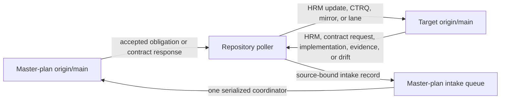

# Bidirectional Master-Plan Repository Polling and HRM Intake

Use this playbook to set up one recurring agent task in each application repository
that participates in an HRM-first organizational master plan. The task watches
both the master plan and its target repository's remote `main` branches from separate
exact commit cursors. Master-plan changes produce approved repository mirror updates,
project HRM-map obligations, contract-update requests, subordinate lane drafts, or
operator decisions. Target-repository changes produce immutable
implementation receipts, evidence pointers, drift findings, or amendment proposals in
the master plan, followed by either a decision request or concise implementation update.

The master plan remains the registry of stable IDs, business intent, authority,
policies, work orders, and cross-system contracts. Each application repository owns
its implementation manifest, complete project HRM map, lane documents, tests, and
evidence pointers. The poller
does not copy either repository wholesale. Reverse synchronization is intentionally
asymmetric: an application repo may report what it declares, tested, or observed, but
it cannot redefine organization policy, authority, or a canonical contract. A single
master-plan intake coordinator serializes inbound receipts and prevents poller races.

## Operating topology



There may be many repository pollers, but only one master-plan intake coordinator.
Use the polling task that lives in the master-plan repository for that coordinator role;
do not create an additional coordinator task unless the organization explicitly needs one.
That coordinator can automatically accept narrowly defined metadata-only receipts after
a pilot; semantic amendments, conflicts, lifecycle promotion, and destructive changes
remain review-bound. Polling, classification, receipt preparation, and validation can run
in parallel across repositories; only the short master-plan merge/read-back is serialized.

## Inputs

- **Organization:** `{{organization}}`
- **Master-plan repository:** `{{master_plan_repository}}`
- **Target repository:** `{{target_repository}}`
- **Poll cadence:** `{{poll_cadence}}`
- **Implementation manifest:** `{{implementation_manifest_or_discover}}`
- **Approved mirror surface:** `{{mirror_surface_or_none}}`
- **Master-plan intake surface:** `{{master_plan_intake_surface_or_discover}}`
- **Lane directory and index:** `{{lane_directory_and_index_or_discover}}`
- **Project HRM map:** `{{project_hrm_map_or_discover}}`
- **Contract-update request surface:** `{{contract_update_request_surface_or_discover}}`
- **Operator directory:** `{{operator_directory_or_master_plan_registry}}`
- **Implementation-update route:** `{{implementation_update_route_or_codex_task}}`
- **Lane-publication authority:** `{{lane_publication_authority_or_draft_only}}`
- **Master-plan mirror authority:** `{{master_plan_mirror_authority_or_draft_receipt_only}}`
- **Historical backfill:** `{{historical_backfill_or_false}}`

Recommended publication values are `draft_only`, `push_docs_branch`, or
`publish_per_repository_rules`. External email, chat, ticket, or provider notifications
require an explicitly approved route; the safe default is an update in the polling task.
Recommended master-plan mirror values are `draft_receipt_only`, `push_intake_branch`,
`open_draft_pr`, or, after a successful pilot, `auto_merge_receipt_only`.

## Failure modes and default recovery

| Problem | Default response |
|---|---|
| Master and target tasks echo the same change | Reconcile causal impact keys and hashes; acknowledge the receipt without producing another write. |
| A feature branch or dirty local worktree changes | Ignore it until the change reaches `origin/main`. |
| Either repository has no durable `origin/main` | Mark synchronization blocked; do not substitute another branch or promote a local observation to organization truth. |
| Several repositories report at once | Prepare in parallel; let the master-plan task serialize intake merges and regenerate shared indexes. |
| A repository change contradicts policy or a canonical contract | Create an amendment proposal; never overwrite master-plan authority from the application repo. |
| An HRM discovers a missing inter-system promise | Create one stable `CTRQ`, route it to the owning system, and block only the dependent HRM; never invent the answer. |
| An accepted change has no typed change envelope or leaves semantic meaning unresolved | Mark `REBASELINE_PENDING`, freeze the affected boundary, and request the missing envelope/decision; do not infer meaning from the diff. |
| A lane or mirror is published but no code changed | Record adoption/planning only, with `implementation: false`. |
| Code merges but the manifest or lane reference is missing | Record drift or a blocker; do not infer stable IDs or implemented coverage from filenames. |
| `main` checks are pending or failed | Hold the implementation receipt pending or blocked until exact-head checks pass. |
| A source branch is rewritten or a write result is ambiguous | Preserve cursors and reconcile exact remote state before any retry. |
| Raw provider, customer, or financial evidence appears | Stop intake, redact at the source, and mirror only approved metadata/pointers. |
| An intake PR conflicts in generated files | Rebase on current master-plan main, regenerate deterministically, and serialize the merge. |
| Notifications become noisy | Deduplicate by impact key, suppress no-action/echo messages, and use a heartbeat digest. |

## Prompt

```text
Set up and operate one bidirectional master-plan polling task for this target repository.

Organization: {{organization}}.
Master-plan repository: {{master_plan_repository}}.
Target repository: {{target_repository}}.
Poll cadence: {{poll_cadence}}.
Implementation manifest: {{implementation_manifest_or_discover}}.
Approved mirror surface: {{mirror_surface_or_none}}.
Master-plan intake surface: {{master_plan_intake_surface_or_discover}}.
Lane directory and index: {{lane_directory_and_index_or_discover}}.
Project HRM map: {{project_hrm_map_or_discover}}.
Contract-update request surface: {{contract_update_request_surface_or_discover}}.
Operator directory: {{operator_directory_or_master_plan_registry}}.
Implementation-update route: {{implementation_update_route_or_codex_task}}.
Lane-publication authority: {{lane_publication_authority_or_draft_only}}.
Master-plan mirror authority: {{master_plan_mirror_authority_or_draft_receipt_only}}.
Historical backfill: {{historical_backfill_or_false}}.

PURPOSE AND AUTHORITY

1. Run as the bidirectional polling task for this target repository only. Use the platform's
   recurring automation or task-wakeup mechanism; do not hold a shell open with an
   infinite loop. Prevent overlapping poll runs.
2. Read every applicable AGENTS.md and repository rule in both repositories. Reconcile
   remotes, `main` branches, worktrees, branches, pull requests, uncommitted work,
   lane conventions, checkers, and notification rules before writing. Preserve user
   work. A polling task is not a Git change unit; create a branch only for a published
   intake/change unit and a worktree only when concurrency, review, or unique-work
   preservation requires it.
3. Default authority is: fetch and inspect both repositories; update an approved
   target-repository mirror or implementation declaration; draft target lane docs;
   prepare or route a documentation-only contract-update request; prepare an HRM status,
   implementation receipt, evidence pointer, drift finding, or amendment proposal for
   master-plan intake; and send a Codex task update. Do not edit canonical
   master-plan policy, authority, or contracts from the target repository. Do not edit
   application code, provider configuration, credentials, production, deployments,
   canaries, customer communication, financial records, or inventory.
4. A master-plan push is evidence of a repository change, not automatic business,
   implementation, merge, activation, or production authority. Act only on accepted
   normative records, accepted work orders, or another explicit target-repository
   obligation. Research, proposals, pending decisions, and generated views may inform
   an update but do not release implementation.

SET UP ONCE

5. Confirm the target repository is registered in the master plan and identify its
   stable system/repository IDs, accountable role, implementation-update route,
   implemented/consumed contract references, and cross-repository dependencies. Do
   not guess a person or notification destination from a display name.
6. Locate the target's implementation manifest, approved mirror surface, lane template,
   lane index, complete project HRM map, contract-update request surface, checker pattern,
   and branch/PR rules. In the master plan, locate its
   implementation-record/intake surface, generated indexes, checker, and single intake
   coordinator. If any required surface or routing contract is absent, prepare one setup
   proposal and pause; do not invent a permanent organization-wide convention inside
   one application repo.
7. Create or validate a poller configuration and state record using the machine contract
   below. Keep runtime task state separate from canonical business records. Do not store
   credentials, customer data, provider payloads, or private evidence. Verify least-
   privilege read/write access without displaying credential values.
8. On the first run, record both `origin/main` heads as baselines after completing
   a read-only impact inventory. Do not generate lanes or receipts for full history unless
   historical_backfill is explicitly true. Report already-accepted target work orders,
   stale implementation declarations, and unrecorded merged lanes before advancing.
9. Present the setup read-back: exact master-plan and target heads, both cursors, registered
   stable IDs, manifest/mirror/HRM-map/contract-request/lane paths, poll cadence,
   publication authority,
   master-plan intake path/authority, notification routing, and unresolved blockers.
   Schedule recurring wakes only after the configuration and authority match the
   operator's instruction.

POLL MASTER PLAN -> TARGET FROM AN EXACT CURSOR

10. At each wake, fetch both remotes and resolve immutable SHAs for `origin/main` in each
    repository. Never treat an unpushed local commit, feature-branch push, draft PR,
    or dirty worktree as accepted organization or implementation state. Compare
    last_completed_master_sha to the new remote master-plan head. If there is no change,
    continue to the target-to-master-plan cursor without sending a message.
11. Require the new source head to descend from the cursor. A rewritten branch, missing
    cursor, unavailable repository, or ambiguous fetch blocks processing. Report the
    exact condition; never silently reset the cursor or treat a force-push as ordinary.
12. Inspect the complete commit range once. Extract changed stable IDs, versions,
    statuses, effective dates, supersession links, work orders, policies, authority
    claims, contracts, contract-update requests, project HRM maps, milestone status,
    integration cards, generated-index changes, and target mappings.
    Separate authored changes from generated artifacts and commit-message claims. Locate
    the accepted typed change envelope for each normative amendment and validate its source
    SHA, before/after versions, provenance, evidence expiry, and acceptance. A diff is not
    a substitute for an envelope and cannot supply missing semantic meaning.
13. Resolve impact using the master-plan registry, accepted work-order targets,
    implementation manifests, contract provider/consumer links, material edges, and
    repository-owned copies. A filename or keyword match alone is not sufficient.
14. Assign one classification to each target impact:
    - NO_ACTION: no target relationship or generated-only change;
    - RECEIPT_ACK: the master plan records an already-reported target SHA; no new lane;
    - INFORMATIONAL: relevant context changed but no accepted implementation obligation;
    - MIRROR_REFRESH: an approved pointer, generated copy, or manifest declaration is stale;
    - REBASELINE_PENDING: the accepted change requires project-plan, manifest, contract, or
      HRM rebaseline before any implementation change unit is safe;
    - HRM_UPDATE: an accepted change alters an HRM prerequisite, evidence need, review
      scenario, blocker, or downstream eligibility in the complete project map;
    - CONTRACT_UPDATE_REQUEST: a stable `CTRQ` is opened, resolved, superseded, or routed
      to this repository as owning provider or consumer;
    - LANE_READY: an accepted target obligation has sufficient contract and acceptance detail;
    - OPERATOR_DECISION: business meaning, authority, scope, compatibility, or owner is unresolved;
    - BLOCKED: required source, target mapping, dependency, repository rule, or safe checker is absent.
15. Use a deterministic impact key from organization, target repository, source range,
    stable IDs, and versions. Reconcile existing branches, lanes, PRs, receipts, and
    prior notices before creating anything. Never duplicate a lane or notification
    because a poll or write result was ambiguous.

REFRESH ONLY REPOSITORY-OWNED MIRRORS

16. The master plan is canonical for stable IDs, intent, policy, authority, work orders,
    and cross-system contract versions. The target repository may mirror only its
    approved implementation manifest, contract reference/fixture, generated excerpt,
    evidence pointer, or synchronization receipt.
17. Every copied or generated item must identify source repository, source commit,
    stable IDs and versions, source status, generation method, refreshed_at, acceptable
    staleness, and the canonical path. Never allow a mirror to look authoritative.
18. Do not change coverage to implemented, deployed, canary, or production_verified
    from a master-plan push. A mirror refresh may declare a required version and the
    honest current coverage: declared, partial, implemented, not_implemented, unknown,
    or deprecated. Code, checks, deployment, and runtime evidence advance separate states.
19. Apply target-repository rules and the configured publication authority. If only
    draft authority exists, leave a reviewable diff in the registered change-unit branch;
    use a worktree only when the conditional workspace policy requires it. If a docs
    branch may be pushed, verify and push that branch. Allow the change to land on
    `main` only when the target's explicit rules authorize that exact lane-doc workflow.

ROUTE THE HRM OBLIGATION AND DRAFT BOUNDED LANES

20. For REBASELINE_PENDING or HRM_UPDATE, consume the typed change envelope and update or
    propose the system plan, requirements, scenarios, implementation manifest, versioned
    project HRM map, and affected milestone contracts without rewriting closed evidence.
    Record semantic/syntactic/behavioral/operational differences, prior/new map versions,
    evidence expiry, affected HRMs, blockers, contract requests, downstream impact, safe
    posture, permitted work, and exact operator-level review consequence. If the envelope
    is missing, stale, or semantically incomplete, freeze the affected boundary and route
    an input/decision request; never reconstruct meaning from code or filenames. For
    LANE_READY, first prove the obligation resolves to a published
    HRM; then draft the smallest subordinate lane. Reconcile the lane number/ID first.
    The lane must
    reference the exact master-plan source range, accepted work order or record IDs,
    contract versions, target base SHA, dependencies, owned files, implementation
    manifest changes, checker, acceptance scenarios, evidence, rollback/recovery,
    assigned target HRM, and explicit non-goals. Include an evidence-based QUICK, SERIAL,
    PARALLEL, or CRITICAL scheduling hint, but leave milestone-bundle derivation and
    release to the System Build and Human Review Milestone Standard and execution order
    to the HRM Bundle Coordination Standard.
21. The lane must state production_effect: none and distinguish documentation, planned
    implementation, implementation, deployment, and production verification. A lane
    draft never grants implementation or external-write authority.
22. If a shared or breaking contract affects multiple repositories, draft only this
    target's lane. Reference the common work order and provider/consumer upgrade order,
    mark unmet predecessor lanes as dependencies, and notify the master-plan coordinator.
    Do not edit another repository or independently choose cross-repository merge order.
23. If a material contract is missing or inadequate, classify CONTRACT_UPDATE_REQUEST
    and create or reconcile one stable `CTRQ` containing evidence, affected HRMs, owner,
    required decision, safe posture, compatibility questions, and resolution/read-back
    criteria. The request is not the answer. Classify OPERATOR_DECISION only when resolving
    it requires new business meaning, authority, risk acceptance, or HRM function/UI/UX
    judgment. Otherwise use verified contracts and read-only discovery without asking
    technical trivia. Use BLOCKED when the owner, source, route, or safe evidence path is absent.

POLL TARGET -> MASTER PLAN FROM A SEPARATE EXACT CURSOR

24. Compare last_assessed_target_sha to the fetched target `origin/main`. Require ancestry
    exactly as for the master-plan cursor. Process `main` history only. A local commit,
    feature branch, draft PR, or CI run without an `origin/main` receipt is not mirrored
    as accepted implementation. A repository without durable `origin/main` is
    REVERSE_BLOCKED, not organization-level truth.
25. Inspect the complete target commit range once, using lane docs, implementation
    manifests, merge/PR metadata, checker/CI evidence, contract mirrors, evidence pointers,
    and changed-path ownership. This is change classification, not a substitute for code
    review and not proof of runtime behavior. Split multiple unrelated lanes/PRs in one
    poll range into separate deterministic impacts and receipts.
26. Ignore ordinary repository maintenance with no registered stable-ID, work-order,
    contract, manifest, lane, or evidence relationship. Do not create master-plan noise
    for dependency bumps, formatting, refactors, tests, or code changes that make no
    organization-level implementation claim.
27. Assign one reverse classification:
    - TARGET_NO_ACTION: no registered master-plan relationship;
    - UPSTREAM_ECHO: the target change is already covered by an exact prior receipt;
    - ADOPTION_RECEIPT: a master-plan mirror, manifest requirement, or lane was accepted
      on target `origin/main` without claiming application implementation;
    - IMPLEMENTATION_RECEIPT: a merged lane declares and checks an accepted obligation;
    - EVIDENCE_RECEIPT: a redacted evidence pointer or compatibility result changed;
    - HRM_STATUS_RECEIPT: a versioned HRM-map or milestone status change was published;
    - CONTRACT_UPDATE_REQUEST: a source-bound `CTRQ` was opened or changed;
    - DRIFT_FINDING: manifest, lane, contract, path, test, or declared coverage disagree;
    - AMENDMENT_PROPOSAL: the target implies a semantic policy, authority, or contract change;
    - REVERSE_BLOCKED: identity, provenance, checks, ownership, or intake authority is missing.
28. Prevent echoes using explicit causal provenance, not message text. Each generated
    mirror, lane, receipt, and notice carries source repository/SHA, target repository/SHA,
    stable IDs/versions, direction, deterministic impact key, caused_by key, content hash,
    and hop_count. UPSTREAM_ECHO advances the target cursor without creating a new receipt.
    A mirrored adoption/implementation receipt later observed in the master plan is
    RECEIPT_ACK and reconciles last_mirrored_target_sha.
29. For ADOPTION_RECEIPT, record the exact target mainline SHA, source master-plan SHA,
    accepted mirror digests or lane/manifest paths, stable IDs/versions, disposition,
    checks, and explicit implementation: false. This closes the planning/adoption loop
    without representing lane publication or contract mirroring as application behavior.
30. For IMPLEMENTATION_RECEIPT, prepare an immutable master-plan record containing the
    repository and component IDs, exact `origin/main` SHA, lane/work
    order/PR, contract and stable-record versions, manifest coverage, owned implementation
    paths, checker/CI result links, review/approval references, known limitations, and the
    deterministic impact key. Required `main` checks must be complete and green;
    pending or failed checks remain pending or blocked. Do not copy source code or full logs.
31. Keep status honest. A merged and checked repository lane may be recorded as a
    repository implementation declaration. It does not prove deployment, provider state,
    canary, production verification, customer effect, financial effect, or runtime
    conformance. Those states require their own exact deployment and evidence records.
32. For EVIDENCE_RECEIPT, mirror metadata and a secure/redacted pointer only. Verify the
    evidence subject, environment, version, window, result, retention location, and
    reviewer; never commit raw customer/provider/financial evidence to the master plan.
33. For DRIFT_FINDING, record the mismatched layers, exact commits/versions, believed
    authority, impact, containment, owner, required evidence, and review/expiry. Do not
    silently edit either side to make the declarations agree.
34. For AMENDMENT_PROPOSAL, create a proposal linked to AP-POLICY-001 with the target
    observation, proposed semantic difference, affected stable IDs/repos, compatibility
    consequences, safe default, and operator decision needed. A changed copied contract,
    lane assumption, or implemented behavior never overwrites canonical master-plan truth.
    Route CONTRACT_UPDATE_REQUEST through AP-POLICY-001 when it requires canonical
    contract meaning, preserving its request status until an approved answer is read back.
35. Treat deletions, renames, removed manifest coverage, and contract-version downgrades
    as drift, deprecation, or amendment candidates. Never delete or supersede a canonical
    master-plan record merely because one repository stopped referencing it.

SERIALIZE MASTER-PLAN INTAKE

36. Each repository poller may prepare only its own source-bound intake record in a
    dedicated master-plan worktree/branch or submit an equivalent immutable envelope.
    It must not share a mutable worktree with another poller or push directly to
    master-plan `main`.
37. One master-plan intake coordinator owns deduplication, repository-rule validation,
    generated index/backlink updates, branch/PR reconciliation, merge order,
    `origin/main` read-back, and post-merge checks for every inbound receipt.
38. Apply master_plan_mirror_authority exactly:
    - draft_receipt_only: prepare a local intake diff and notify;
    - push_intake_branch: verify and push a source-specific branch;
    - open_draft_pr: push and open/reuse one draft intake PR;
    - auto_merge_receipt_only: the intake coordinator may merge only a metadata-only,
      schema-valid ADOPTION_RECEIPT, IMPLEMENTATION_RECEIPT, EVIDENCE_RECEIPT,
      HRM_STATUS_RECEIPT, or documentation-only CONTRACT_UPDATE_REQUEST with no
      policy, authority, contract, lifecycle, deletion, conflict, secret, PII, or operator
      decision change.
39. DRIFT_FINDING, AMENDMENT_PROPOSAL, a contract answer that changes meaning or authority,
    REVERSE_BLOCKED, breaking compatibility, status advancement beyond repository
    implementation, or any ambiguous write always remains
    review-bound. Batch related findings; do not open competing PRs for the same target SHA.

ROUTE THE SMALLEST USEFUL UPDATE

40. Route by stable role and configured destination:
    - NO_ACTION: no immediate message; include it in the heartbeat digest;
    - RECEIPT_ACK or UPSTREAM_ECHO: no new message unless reconciliation failed;
    - INFORMATIONAL: concise context update with no lane and no response requested;
    - MIRROR_REFRESH: implementation update with source SHA, refreshed surface, checks,
      branch/PR or draft location, and next authorized action;
    - REBASELINE_PENDING or HRM_UPDATE: send the system-build orchestrator the affected
      HRMs, map version, change-envelope ID/SHA, evidence expiry, blocker/rebaseline state,
      safe posture, permitted work, exact sources, and next authorized action;
    - CONTRACT_UPDATE_REQUEST: route the `CTRQ` to the registered contract owner and
      affected HRM orchestrators; use S0 immediately, S1 before semantic assumption or
      non-disposable work, S2 in a bounded batch, and S3 without operator interruption.
      Do not wait for a prepared HRM when the latest safe decision time is earlier;
    - LANE_READY: implementation update suitable for AP-LANE-001 coordination, with lane
      link/path, exact source and target SHAs, scheduling hint, dependencies, checker,
      human gates, publication state, and whether execution is ready;
    - OPERATOR_DECISION: one decision request containing S0-S2 class, first foreseeable/
      notified and latest-safe times, current authority, exact question, evidence/expiry,
      invalidation reach, recommendation, at most three alternatives, consequences,
      affected repos/HRMs, safe posture, permitted continuation, and reply syntax;
    - ADOPTION_RECEIPT, IMPLEMENTATION_RECEIPT, EVIDENCE_RECEIPT, or HRM_STATUS_RECEIPT:
      after master-plan intake read-back,
      send one implementation update with exact repo/master SHAs, receipt, checks, and
      status limits;
    - PENDING_INTAKE: send the intake coordinator a compact branch/PR/draft update; do not
      tell the business operator that the master plan has been mirrored yet;
    - DRIFT_FINDING or AMENDMENT_PROPOSAL: route one decision packet to the registered
      technical or business owner and the master-plan coordinator;
    - BLOCKED or REVERSE_BLOCKED: blocker update naming owner, failed evidence,
      staleness, and recovery action.
41. An implementation update is a handoff, not a request for routine permission. Ask an
    operator only for business meaning, authority, material scope, risk acceptance,
    UI/UX/function acceptance, or an action-time production decision. Do not require the
    operator to approve file names, test mechanics, or ordinary implementation details.
42. Read every accepted operator response back as exact meaning, scope, exclusions,
    affected records, and expiry before unfreezing or marking rebaseline complete. Keep
    notifications idempotent and compact. Never include credentials, PII, customer
    records, raw provider payloads, or full test logs. Link exact commits, lanes, PRs,
    artifacts, HRM maps, contract requests, and operator briefs instead. Keep routine
    poll/lane progress quiet; make a prepared HRM stop, material decision, or persistent
    blocker conspicuous.
43. External email, chat, ticket, provider, or repository-comment notification is a
    write. Use it only when that route and message class are explicitly authorized, then
    read back delivery. Otherwise post the update in this Codex task for the operator.

CHECKPOINT AND RECOVER

44. Run repository-appropriate validation for every target mirror/lane change and every
    master-plan intake record. Bind checks to exact heads or diffs. Read back any branch
    push, PR, `main` update, merge, generated index, or external notification.
45. Advance last_completed_master_sha only after every forward impact has a durable
    disposition: no action, informational receipt, verified mirror update, HRM update,
    contract-update request, lane draft,
    decision request, or explicit blocker. Record partial progress separately so a crash
    cannot skip work.
46. Advance last_assessed_target_sha only after every reverse impact has a durable
    disposition. Advance last_mirrored_target_sha only after master-plan `origin/main`
    contains and validates the exact target receipt. Track an open intake
    PR separately; do not resend it on every poll.
47. On an ambiguous write, reconcile remote state and the deterministic impact key before
    retrying. On repeated source failure, preserve the cursor, fail closed after the
    configured maximum staleness, and notify the configured operator/coordinator.
48. Finish each active poll with one compact bidirectional receipt: both source ranges
    and heads, impacts by direction/classification, HRMs/contract requests/files/lanes/intake records/PRs,
    checks, notifications, external writes, both cursors, blockers, and next wake/action.
    Never claim that a lane draft, repository merge, receipt, or notification proves
    deployment, activation, canary, or production verification.
```

## Machine-readable poller configuration

```yaml
poller:
  schema_version: agent_playbooks.master_plan_poller.v5
  id: "{{organization}}:{{target_repository}}"
  status: proposed
  organization: "{{organization}}"
  master_plan:
    repository: "{{master_plan_repository}}"
    branch: main
    registry_paths: []
    work_order_paths: []
    intake_surface: "{{master_plan_intake_surface_or_discover}}"
    change_envelope_surface: null
    intake_coordinator: null
  target:
    repository: "{{target_repository}}"
    branch: main
    stable_ids: []
    implementation_manifest: "{{implementation_manifest_or_discover}}"
    mirror_surface: "{{mirror_surface_or_none}}"
    project_hrm_map: "{{project_hrm_map_or_discover}}"
    contract_update_request_surface: "{{contract_update_request_surface_or_discover}}"
    lane_directory: null
    lane_index: null
  schedule:
    cadence: "{{poll_cadence}}"
    heartbeat: daily
    max_staleness: null
    overlapping_runs: reject
  authority:
    master_plan_read: read_only
    target_write: draft_only
    lane_publication: "{{lane_publication_authority_or_draft_only}}"
    master_plan_mirror: "{{master_plan_mirror_authority_or_draft_receipt_only}}"
    master_plan_main_write: false
    application_implementation: false
    external_or_production_mutation: false
  routing:
    operator_directory: "{{operator_directory_or_master_plan_registry}}"
    implementation_update: "{{implementation_update_route_or_codex_task}}"
    decision_request: codex_task
    external_routes_authorized: []
  decision_frontier:
    s0_route: immediate
    s1_route: before_non_disposable_work
    s2_route: bounded_batch
    s3_route: autonomous_record
    semantic_read_back_required: true
  cursors:
    master_plan:
      baseline_sha: null
      last_completed_sha: null
      in_progress_sha: null
    target:
      baseline_sha: null
      last_assessed_sha: null
      in_progress_sha: null
      last_mirrored_sha: null
      pending_intake_pr: null
    last_heartbeat_at: null
  historical_backfill: false
```

## Machine-readable master-plan intake record

```yaml
intake_record:
  schema_version: agent_playbooks.repository_intake.v3
  id: "{{target_repository}}:{{target_sha}}:{{impact_key}}"
  kind: "adoption_receipt|implementation_receipt|evidence_receipt|hrm_status_receipt|contract_update_request|drift_finding|amendment_proposal"
  status: proposed
  source:
    repository: "{{target_repository}}"
    branch: main
    from_sha: null
    to_sha: null
    lane: null
    work_order: null
    pr: null
  destination:
    repository: "{{master_plan_repository}}"
    intake_path: "{{master_plan_intake_path}}"
  causality:
    direction: target_to_master
    impact_key: "{{impact_key}}"
    caused_by: null
    hop_count: 1
    content_hash: null
  scope:
    stable_ids: []
    versions: []
    repository_paths: []
    affected_hrms: []
    contract_request_ids: []
    change_envelope_ids: []
  rebaseline:
    state: "not_required|pending|complete|blocked"
    safe_posture: null
    permitted_work: []
    evidence_expires_at: null
  claims:
    master_plan_adoption: unknown
    repository_implementation: unknown
    deployed: unknown
    canary: unknown
    production_verified: unknown
  manifest:
    path: null
    coverage: "declared|partial|implemented|not_implemented|unknown|deprecated"
  checks: []
  evidence_pointers: []
  limitations: []
  owner: null
  operator_decision_required: false
  git_mutations: []
  provider_or_production_mutations: 0
  disposition: pending_intake
```

## Machine-readable poll receipt

```yaml
poll:
  id: "{{deterministic_poll_id}}"
  poller_id: "{{organization}}:{{target_repository}}"
  started_at: null
  completed_at: null
  master_plan_range:
    from_sha: null
    to_sha: null
    ancestry_verified: false
  target_range:
    from_sha: null
    to_sha: null
    ancestry_verified: false
  target_result:
    base_sha: null
    result_sha: null
  impacts:
    - impact_key: null
      direction: "master_to_target|target_to_master"
      caused_by: null
      hop_count: 0
      content_hash: null
      stable_ids: []
      versions: []
      classification: "no_action|receipt_ack|informational|mirror_refresh|hrm_update|contract_update_request|lane_ready|operator_decision|blocked|target_no_action|upstream_echo|adoption_receipt|implementation_receipt|evidence_receipt|hrm_status_receipt|drift_finding|amendment_proposal|reverse_blocked"
      reason: null
      mirror_changes: []
      affected_hrms: []
      contract_request_ids: []
      lane: null
      master_plan_intake_record: null
      branch: null
      pr: null
      checks: []
      notification:
        kind: "none|heartbeat|pending_intake|implementation_update|decision_request|blocker"
        route: codex_task
        delivered: false
        read_back: false
      disposition: null
  git_mutations: []
  provider_or_production_mutations: 0
  cursors:
    master_plan_advanced: false
    target_assessed_advanced: false
    target_mirrored_advanced: false
  blocker: null
  next_authorized_action: next_poll
```

## Change note

- **1.0 — 2026-08-24:** Generalizes ownership and intake; consumes typed master-plan
  change envelopes; adds evidence expiry, fail-closed `REBASELINE_PENDING`, S0-S3 early
  routing, semantic read-back, and conditional Git workspace creation. A diff cannot
  supply missing meaning, and propagation never implies rollout authority.
- **0.5 — 2026-08-21:** Moves polling intake to the HRM abstraction, watches complete
  project HRM maps, routes stable non-adopting `CTRQ` records, keeps lanes subordinate,
  and suppresses routine noise until a prepared HRM, material decision, or persistent
  blocker needs operator attention.
- **0.4 — 2026-08-21:** Routes a drafted lane into the HRM-first workflow: the system-
  build playbook derives and releases milestone bundles, and the lane coordinator owns
  execution order. A draft now names its assigned target HRM rather than an informal
  human milestone.
- **0.3 — 2026-08-20:** Fixes both synchronization sources to literal `origin/main`.
  Feature branches, draft PRs, local commits, dirty worktrees, and repositories without
  a durable `main` branch cannot produce organization-level mirror records.
- **0.2 — 2026-08-20:** Adds target-default-branch polling and asymmetric reverse
  synchronization through adoption/implementation/evidence receipts, drift findings, and policy
  amendment proposals. Adds causal no-echo metadata, separate cursors, default-branch
  truth boundaries, a single serialized master-plan intake coordinator, and a narrowly
  configurable receipt-only automation path.
- **0.1 — 2026-08-20:** Initial draft. Defines one cursor-driven task per target
  repository, accepted-record impact classification, bounded mirror refreshes and lane
  intake, role-based low-noise notification, cross-repository dependency handling,
  idempotent receipts, and strict separation from implementation and production authority.
